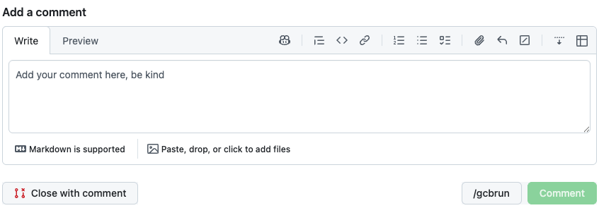

# GitHub /gcbrun Button

This is a Chrome extension that injects a `/gcbrun` button into GitHub pull request comment forms.

The button is added on the left side of the green `Comment` button.

Clicking `/gcbrun` inserts the `/gcbrun` command into the comment textarea and submits the comment.

## Installation

1. Open the Chrome extensions page by navigating to `chrome://extensions/`
2. Enable developer mode
3. Click "Load unpacked" and select this folder
4. Open any GitHub pull request page
5. Find the "Add a comment" box
6. Click the `/gcbrun` button to insert the command and post the comment
